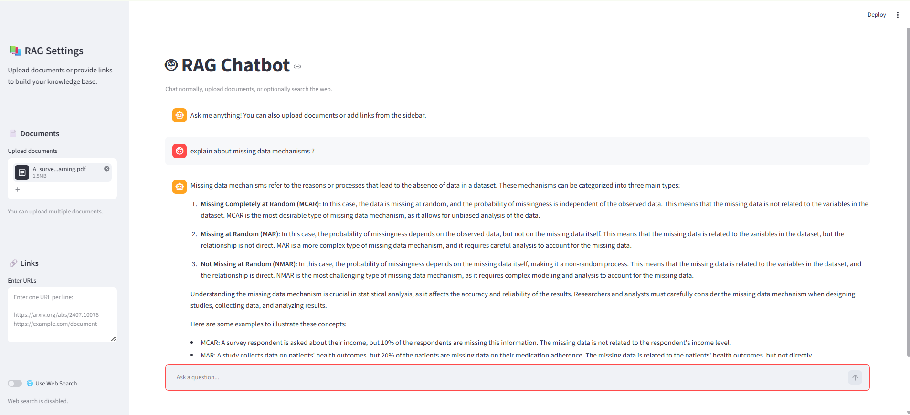

# 🤖 RAG-Based Chatbot (Personal Assistant)

A powerful Retrieval-Augmented Generation (RAG) chatbot built with **Streamlit**, **LangChain**, and **Hugging Face** that combines document-based knowledge retrieval with web search capabilities.

## Architecture



## ✨ Features

- 📄 **Multi-format Document Support**: Upload PDF, Word, Excel, and other document formats
- 🔗 **Web Source Integration**: Add URLs to expand your knowledge base
- 🌐 **Web Search Capability**: Optional real-time web search for current information
- 🎯 **Hybrid Retrieval**: Combines BM25 keyword search with dense vector search
- 🔄 **Semantic Re-ranking**: Smart reranking of retrieved documents for better relevance
- 💬 **Interactive Chat Interface**: Clean, user-friendly conversation interface
- 📊 **Source Attribution**: See where answers come from with expandable source details
- ⚡ **Fast & Responsive**: Efficient document processing and retrieval

## 🎨 Frontend Layout

The application uses **Streamlit** for a beautiful, responsive web interface:

### Main Components:

#### **Sidebar (Left Panel) - Settings & Configuration**
- **📚 RAG Settings Section**
  - 📄 Document Upload: Multi-file upload support with drag-and-drop
  - 🔗 Links Section: Enter multiple URLs (one per line)
  - 🌐 Web Search Toggle: Enable/disable web search functionality
  - ⚙️ Process Documents Button: Start the RAG pipeline
  - 📊 Status Display: Shows knowledge base readiness and chunk count
  - 🗑️ Clear Chat & Documents: Reset the application

#### **Main Chat Area (Center Panel)**
- 🤖 **Header**: "RAG Chatbot" title with descriptive caption
- 💬 **Chat History**: Displays all messages in a scrollable conversation view
  - User messages (right-aligned)
  - Assistant responses (left-aligned)
  - 📚 Source expanders showing retrieved documents
- ⌨️ **Chat Input**: Text input field at the bottom for user queries
- 🎯 **Source Information**: Expandable sections showing:
  - Source title and URL
  - Content preview (first 300 characters)
  - Metadata (source type, URL origin)


## 🚀 Getting Started

### Prerequisites
- Python 3.8+
- pip or conda

### Installation

1. **Clone the repository**
   ```bash
   git clone https://github.com/lokeshmangamuri/Chatbot-Personal-Assistant.git
   cd Chatbot-Personal-Assistant
   ```

2. **Install dependencies**
   ```bash
   pip install -r requirements.txt
   ```
   
   Or using the provided pyproject.toml:
   ```bash
   pip install streamlit langchain huggingface-hub chromadb
   ```

3. **Run the application**
   ```bash
   streamlit run main.py
   ```

4. **Access the chatbot**
   - Open your browser and go to `http://localhost:8501`

## 💡 Usage Guide

### Step 1: Add Knowledge Sources
- **Upload Documents**: Click "Upload documents" to add PDFs, Word docs, etc.
- **Add URLs**: Enter web links (one per line) in the "Enter URLs" field
- **Enable Web Search**: Toggle "Use Web Search" for real-time internet queries

### Step 2: Process Documents
- Click the **"⚙️ Process Documents"** button
- Wait for the system to load, chunk, and create embeddings
- Check the status indicator showing "🟢 Knowledge Base Ready"

### Step 3: Start Chatting
- Type your question in the chat input field
- The chatbot will:
  1. Retrieve relevant documents
  2. Optionally search the web
  3. Re-rank results for relevance
  4. Generate an answer using Llama 3.1 8B
  5. Show source documents in expandable sections

### Step 4: Clear & Reset
- Click **"🗑️ Clear Chat & Documents"** to reset the application
- Type "exit" in the chat to reset during a conversation

## 🔧 Configuration

### Environment Variables
Create a `.env` file (if needed) for API keys:
```env
HF_TOKEN=your_hugging_face_token
```

### Model Configuration
- **Embedding Model**: Sentence Transformers (default)
- **LLM**: Meta Llama 3.1 8B Instruct
- **Vector DB**: Chroma (persistent local storage)
- **Web Search**: Tavily API integration


## 👤 Author

**Lokesh Mangamuri**
- GitHub: [@lokeshmangamuri](https://github.com/lokeshmangamuri)


⭐ If you found this project helpful, please consider giving it a star!
